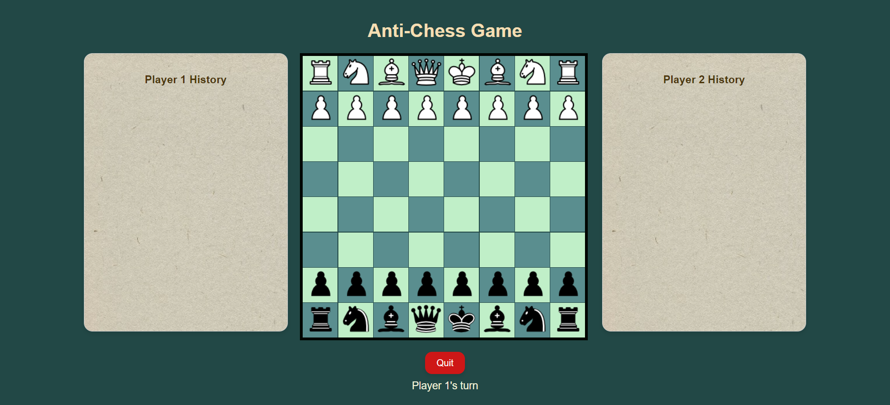

# Anti-Chess

Lose all your pieces to win the game.
Antichess is an eccentric variant where you lose all your pieces to win.

## Deployment

To run this project click on 

[Anti-Chess](https://subhadeepkhan1911.github.io/Chess/)

## Rules

- Pieces move the same way they do in standard chess; however, kings lose their royal powers - they cannot castle, and checks are no longer a threat. Since kings have lost their royal powers, pawns may be promoted to kings.
- Capturing is forced. If you can take a piece, you must. If multiple pieces can be captured, you may choose which piece you capture.

## Authors

- [Subhadeep Khan](https://www.linkedin.com/in/subhadeep-khan-39724222a/)

## Screenshot

